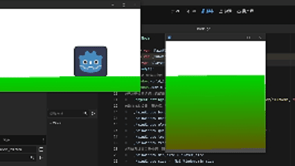

# 大概半年前大一学godot时在油管学到的，快忘光了用AI回忆了下分享出来，如有不足请在评论区指出。

本文章内容可用于实现在多个独立窗口中显示同一场景的不同区域

稍作修改也可让各个窗口动起来

------

## 一、最终效果预览



- 仅显示子窗口，窗口大小位置可由检查器或脚本控制
- 两个窗口共享同一个 2D 世界，相机随窗口位置实时联动

------

## 二、场景节点结构

节点结构如下：

```
Node（挂载全局脚本）
├─ Window（子1窗口，内置 Camera2D）
├─ Window2（子2窗口，内置 Camera2D）（可添加更多子窗口）
└─ Node2D（存放所有游戏实体：角色、地面、碰撞等）（建议用单独的场景）
```

- 每个窗口节点下挂载一个`Camera2D节点`控制窗口显示区域

------

## 三、根节点 Node 脚本

负责窗口初始化、透明配置、多窗口世界同步、尺寸限制。

```
extends Node

@onready var _MainWindow: Window = get_window()
@onready var _SubWindow: Window = $Window
@export var player_size: Vector2i = Vector2i(32, 32)

func _ready():
    # 多窗口共享同一个2D世界
    $Window.world_2d = _MainWindow.world_2d
    $Window2.world_2d = _MainWindow.world_2d
    #可以在此处添加更多子窗口

    # 开启逐像素透明
    ProjectSettings.set_setting("display/window/per_pixel_transparency/allowed", true)

    # 主窗口（底图）基础配置
    _MainWindow.borderless = true    #去边框和标题栏
    _MainWindow.unresizable = true    #禁止缩放主窗口
    _MainWindow.always_on_top = true    #窗口保持置顶
    _MainWindow.gui_embed_subwindows = false    #子窗口转为系统原生窗口，可独立移动
    _MainWindow.transparent = true    #允许窗口透明
    _MainWindow.transparent_bg = true    #去掉默认的灰色背景
                                    （虽然有时候还是会在，建议底图用一张纯色填充）

    # 突破系统最小窗口限制（没有的话会只显示作为底图的全场景）
    _MainWindow.min_size = player_size
    _MainWindow.size = _MainWindow.min_size
```

------

## 四、Window / Window2 窗口脚本

用来控制子窗口的显示与挪动窗口的同步

```
extends Window

@onready var _Camera: Camera2D = $Camera2D
var last_position = Vector2i.ZERO
var velocity = Vector2i.ZERO

func _ready() -> void:
    # 相机锚点固定左上角，使窗口坐标与相机坐标直接对齐
    _Camera.anchor_mode = Camera2D.ANCHOR_MODE_FIXED_TOP_LEFT
    # 设为附属窗口，主窗口关闭时自动销毁
    transient = true
    # 关闭请求时释放节点
    close_requested.connect(queue_free)

func _process(delta: float) -> void:
    # 计算窗口移动速度
    velocity = position - last_position
    last_position = position
    # 相机跟随窗口移动
    _Camera.position = get_camera_pos_from_window()

func get_camera_pos_from_window() -> Vector2i:
    return position + velocity
```

------

## 五、关键配置说明

1. **透明窗口生效条件**

   - 项目设置开启：`显示 → 窗口 → 模式 → Fullscreen`
   - `显示 → 窗口→嵌入式子窗口→取消勾选`
   - 右上角兼容改成Forward+

2. **子窗口可独立拖动**必须设置：

   ```
   _MainWindow.gui_embed_subwindows = false
   ```

   否则子窗口会嵌入主窗口，无法拖动。

3. **相机视角同步**`Camera2D` 锚点设为 `FIXED_TOP_LEFT`，保证窗口位置与相机位置直接映射。

------

## 六、结语

当初找了很久也没找到在文章里详细解释的实现方法，现在想起来了就顺手做个分享，第一次写博客应该会有许多不足，请多指正，之后更新应该会去记录在学习游戏开发中实现的功能，感谢你的耐心阅读。