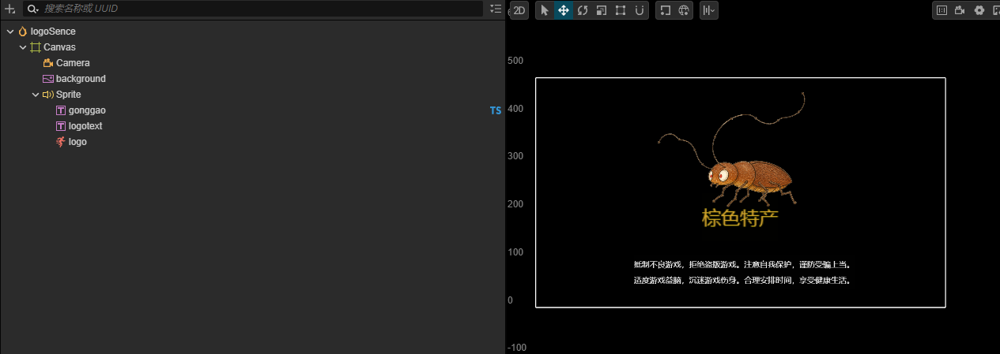
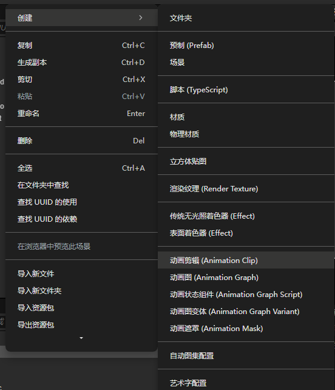
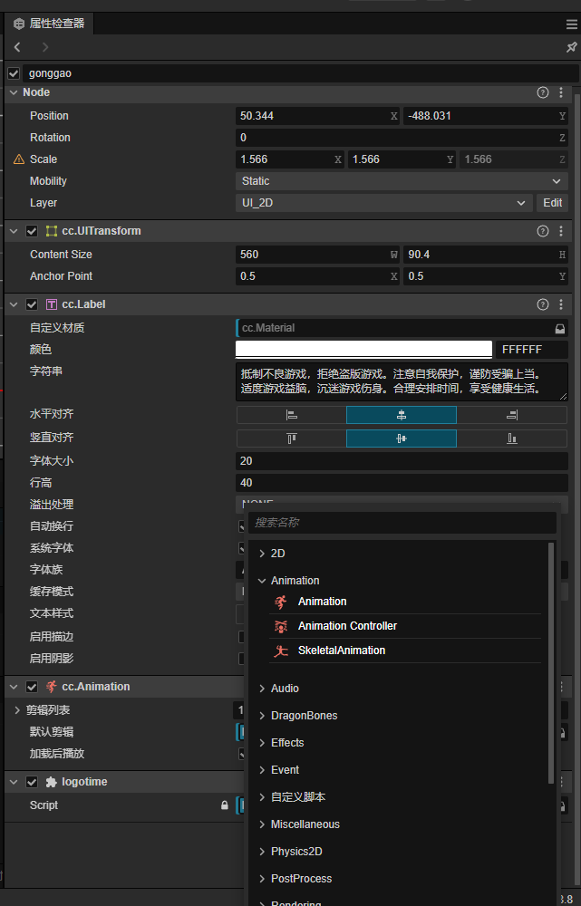
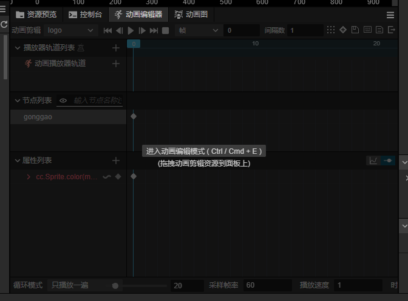
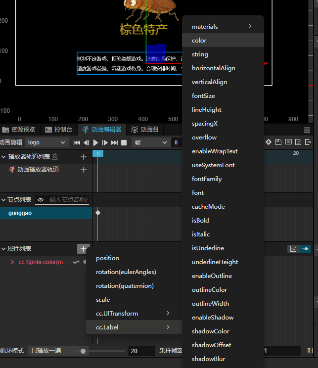
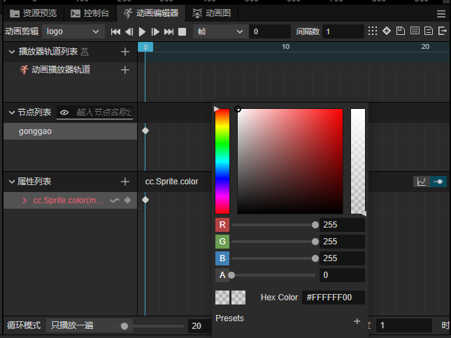
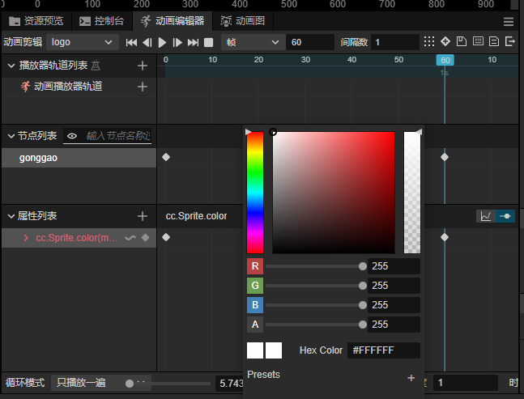
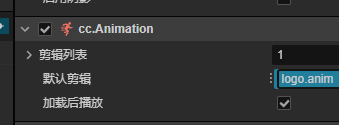

# **基于cocos 3.8.8的天天酷跑类游戏开发讲解**

小游戏的首选，试了下与unity还是有许多相似之处的，遂记录。

## 以下从功能的顺序开始讲解

### 1.加载场景



以logo也就是开屏动画场景举例

1.右键资源管理器（Assets）创建脚本（create->TypeScript）,打开脚本

2.在start函数中写入director.loadScene("场景名字)如下

```typescript
import { _decorator, Component, Node,director } from 'cc';
const { ccclass, property } = _decorator;

@ccclass('logotime')
export class logotime extends Component {
  start() {
    setTimeout(()=>{director.loadScene("first_menu"); }, 2000);
    //setTimeout(调用的函数，时间(以毫秒为单位))可借用此函数延迟执行调用的函数
  }
  update(deltaTime: number) {  
  }
}
```

之后运行游戏就能有延迟加载场景的效果了（渐变效果需看下一点）

### 渐变效果

**对于渐变的效果本项目用到了两种实现方式**:

#### 1.Twween缓动动画（在脚本中完成）

```typescript
 import { _decorator, Color, Component, director, Node, Sprite, tween } from 'cc';//注意包含的库文件要齐全
const { ccclass, property } = _decorator;

@ccclass('Logo')
export class Logo extends Component {


 start() {
    // getComponent获取当前脚本所在主体的组件---Sprite

    let sp = this.getComponent(Sprite);

    //设置颜色 R G B A(透明度)

    sp.color = new Color(255, 255, 255, 0);

    //缓动动画( sp目标物体  tw给当前目标物体做缓动动画的实例

    let tw = tween(sp);

    tw.delay(1);

    tw.call(this.playSound);

    //给颜色color设定目标值,让物体在指定时间缓慢变化导该目标值

    tw.to(0.5, { color: new Color(255, 255, 255, 255) });

    //当前动画,delay延时1秒钟

    tw.delay(1);

    //颜色在0.5秒时间内,缓慢变为透明的

    tw.to(0.5, { color: new Color(255, 255, 255, 0) });

   //call  执行切换场景函数  一定注意:函数作为参数传递,严禁带括号

    tw.call(this.changeScene);

    //启动动画

    tw.start();

  }

 changeScene() {//在此函数里加载场景

    director.loadScene("loginScene");

  }
```


#### 2.动画剪辑（在动画编辑器中实现，不用写代码）

##### A.右键文件夹创造动画剪辑文件



##### B.在需要动画的节点上添加动画组件（Animation）



（点击右侧属性检查器下的添加组件）

##### c.打开动画编辑器



##### D.进入动画编辑模式，并添加属性列表点击color



##### E.在第零帧添加关键帧（左侧红色列表的那条蛆右边的菱形就是添加关键帧）

点击色块打开颜色编辑，将A的值拖动到0



在第60帧（这里设置的是1秒60帧，，可以计算下渐变时间），添加关键帧，将A拖到255



###### F.最后记得将循环模式设为直播放一遍，并在右侧动画组件勾选加载后播放即可

